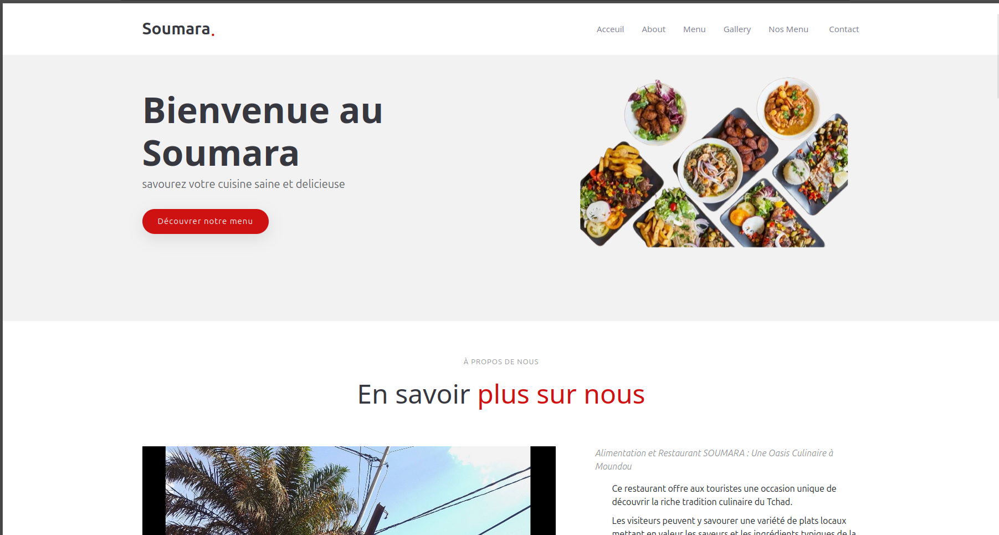
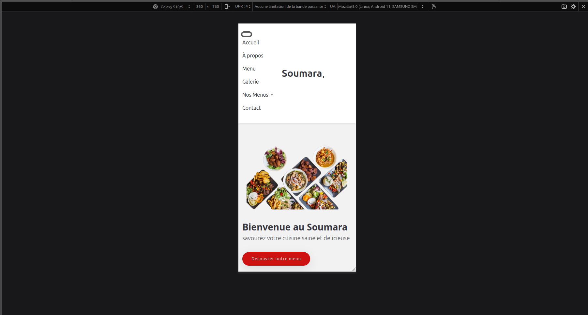

# Soumara – Site Vitrine Restaurant Libanais

  
  

## Description
Soumara est un restaurant libanais situé à Moundou, à côté du rond-point de la Femme. Le restaurant propose une expérience culinaire conviviale et chaleureuse avec des plats savoureux et authentiques.

Le site vitrine permet de :  
- Découvrir l’ambiance du restaurant et sa carte.  
- Visualiser des photos attractives des plats et de l’espace.  
- Accéder facilement aux informations de contact et localisation.  
- Naviguer sur mobile et desktop grâce à un design responsive et moderne.


lien du site sur github :  https://dououbunlaye.github.io/site-soumara/
makette du site : https://www.figma.com/design/jn020CSzr8Eu8aHy9KFfAN/Soumara-site?node-id=0-1&p=f&t=dsGTaB6uFtXlwdEU-0
le depote github : https://github.com/doudouabdoulaye/site_soumara

## Installation / Lancement
1. Cloner le projet :  
```bash
git clone https://github.com/votre-utilisateur/soumara.git
